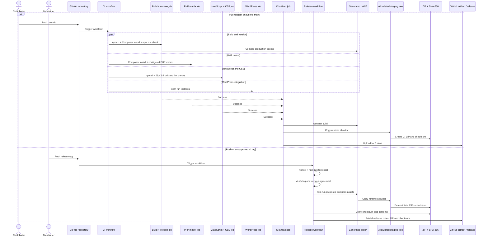

# Development architecture

## Source and generated artifacts

Source artifacts:

- `src/`
- `includes/`
- plugin bootstrap
- `assets/js/editor-preview-controller.js`

Generated artifacts:

- `build/`, generated by `wp-scripts`
- compiled translation catalogs, generated from the English sources and German
  PO catalog

Never edit generated assets to make a source change.

PHP owns:

- registration
- authenticated editor endpoints
- parsing shared with server rendering
- dynamic markup

JavaScript owns:

- editor interaction
- per-instance browser state

SCSS owns plugin presentation.

Unit, WordPress/browser and manual test layers exercise the same observable
contract.

## Delivery architecture

`package-lock.json` and `composer.lock` pin the dependency graphs. Local and CI
quality gates install from those locks.

The CI artifact is short-lived and available only after all independent jobs
pass. A tag build repeats the complete gate. It then verifies version agreement
and publishes the deterministic release package.

| Generated artifact | Producer | Consumer or lifetime |
| --- | --- | --- |
| `build/` | `wp-scripts build` | Runtime allowlist for both package variants |
| Compiled translation catalogs | i18n generation in the quality gate | Committed/runtime language files |
| `yt-playlist-player-ci.zip` and checksum | CI artifact job | Review installation; retained for three days |
| `dist/yt-playlist-player.zip` and checksum | `scripts/build-zip.sh` | Release verification and GitHub Release |
| GitHub Release notes | Tag workflow | Immutable release record |

Executable procedures are in [development setup](../development/setup.md),
[development workflow](../development/workflow.md),
[test strategy](../testing/strategy.md), [CI](../operations/ci.md) and
[releases](../operations/releases.md).
