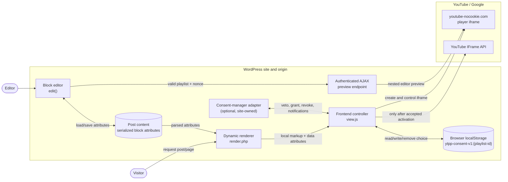

# Architecture overview

The YouTube Playlist Player follows WordPress's standard block model. The
official Block Editor Handbook describes the generic interfaces:

- [registration of a block](https://developer.wordpress.org/block-editor/getting-started/fundamentals/registration-of-a-block/)
- [`block.json` metadata](https://developer.wordpress.org/block-editor/reference-guides/block-api/block-metadata/)
- [block attributes](https://developer.wordpress.org/block-editor/reference-guides/block-api/block-attributes/)
- [`edit` and `save`](https://developer.wordpress.org/block-editor/reference-guides/block-api/block-edit-save/)

This document does not repeat those interfaces. It records how this plugin uses
them. The plugin is a metadata-registered, dynamically rendered block. Its
`edit` component updates attributes in Gutenberg. Its `save` function returns
no markup. WordPress persists the attributes and calls the PHP render template
when a post or page is rendered.

## Boundaries and dependencies

| Boundary | Responsibility | Dependency direction |
| --- | --- | --- |
| WordPress | Persist block attributes, register assets, authorize editor requests and invoke dynamic rendering | The plugin uses WordPress APIs and follows the [supported-platform requirement](../requirements/quality.md#nfr-001) |
| Plugin PHP | Validate attributes and produce local frontend markup | It does not request YouTube content |
| Plugin JavaScript | Provide the editor UI, consent gate, player lifecycle and navigation | It calls YouTube only at the documented activation points |
| Browser storage | Store one origin-scoped choice per canonical playlist | Only plugin JavaScript accesses the `ytpp-consent-v1:*` entries |
| Consent-manager adapter | Supply site-specific permission decisions | It integrates through the public PHP filter and browser events |
| YouTube / Google | Deliver the API, iframe document and media | It is outside the plugin and WordPress trust boundary |

Editable assets and block metadata live in `src/`. PHP helpers live in
`includes/`. The production build in `build/` is generated.

### Iframe layering

| Context | Layering | Purpose |
| --- | --- | --- |
| Public page before activation | WordPress document → local `.ytpp-player` markup | Keep the initial consent UI on the site origin; no YouTube iframe exists |
| Public page after activation | WordPress document → `.ytpp-player__target` → cross-origin `youtube-nocookie.com` iframe | Keep plugin navigation in the host document while YouTube owns the embedded player document |
| Editor preview | Gutenberg editor document → same-origin `admin-ajax.php` preview document → cross-origin `youtube-nocookie.com` iframe | Give the YouTube embed a normal HTTP(S) site origin even when the Gutenberg canvas uses a `blob:` URL |
| Availability check | Gutenberg inspector → hidden same-origin check document → YouTube IFrame API and `youtube-nocookie.com` iframe | Isolate the explicit check and return only a classified result through validated `postMessage` |

The plugin can create, replace and remove an iframe element. It cannot inspect
or modify the cross-origin document inside the YouTube iframe.

## Public interfaces

| Interface | Defined by | Detailed contract | Purpose |
| --- | --- | --- | --- |
| Block type `yt-playlist-player/player` | `src/block.json` and `src/index.js` | [Block attribute contract](../integrations/block-attributes.md) | Register the editor component, supported alignment, runtime assets and dynamic renderer |
| Persisted block attributes | `attributes` in `src/block.json`; WordPress also supplies the supported `align` attribute | [Block attribute contract](../integrations/block-attributes.md) | Store editor choices in the serialized block inside post content |
| Rendered wrapper and data attributes | `src/render.php`, rooted at `.ytpp-player` | [Frontend DOM bridge](#frontend-dom-bridge) | Connect server-rendered state to the frontend controller and provide the integration target |
| CSS custom properties | `src/style.scss` and `src/editor.scss` | [Public CSS custom properties](../integrations/theming.md#public-css-custom-properties) | Let themes change documented dimensions, spacing, colors and focus presentation |
| PHP filter `ytpp_require_consent` | `src/render.php` | [WordPress filter](../integrations/consent.md#wordpress-filter) | Let a site-wide consent solution replace the built-in gate at render time |
| Browser events `ytpp:*` | `src/view.js` | [JavaScript events](../integrations/consent.md#javascript-events) | Let a consent manager veto loading, grant or revoke permission and observe transitions per block |

### Frontend DOM bridge

| Output | Value and purpose |
| --- | --- |
| `.ytpp-player` | Root of one block instance; target for public command events and selector for notification events |
| `data-playlist-id` | Canonical playlist ID, or an empty value for invalid input; selects configured instances and supplies the player ID |
| `data-require-consent` | `true` or `false` after applying the PHP filter; tells the frontend controller whether it may request activation without the local button |
| Inline `--ytpp-max-width`, `--ytpp-max-height` and `--ytpp-aspect-ratio` | Validated per-block sizing passed from PHP to CSS |

Other descendant classes support the plugin's own controller, markup and
presentation. They are not separate integration interfaces unless another
contract explicitly names them.

The authenticated editor-preview endpoint and its `postMessage` payload are
internal interfaces. They may change with the editor implementation. The public
interfaces above must retain their documented behavior or receive an explicit
migration.

## Invariants

- Invalid input never becomes an external embed URL.
- With the built-in gate enabled, public pages contact no YouTube or Google
  player resource before an accepted activation.
- Loading a player does not start playback automatically.
- Multiple block instances maintain independent player state.
- Editor preview and check requests require an authenticated editor and nonce.
- Release ZIPs contain runtime files only and can be reproduced from a commit.

See [runtime flows](runtime.md) and [development architecture](development.md).

## Architecture decisions

- [ADR 0001: Keyless playlist availability check](decisions/0001-keyless-playlist-availability-check.md)
- [ADR 0002: WordPress 6.1 minimum and metadata-driven dynamic rendering](decisions/0002-minimum-wordpress-and-dynamic-rendering.md)
- [ADR 0003: Deferred YouTube loading and consent](decisions/0003-deferred-youtube-loading-and-consent.md)
- [ADR 0004: Same-origin editor preview](decisions/0004-same-origin-editor-preview.md)
- [ADR 0005: Layered quality gate](decisions/0005-layered-quality-gate.md)
- [ADR 0006: Reproducible allowlisted release package](decisions/0006-reproducible-allowlisted-release-package.md)
