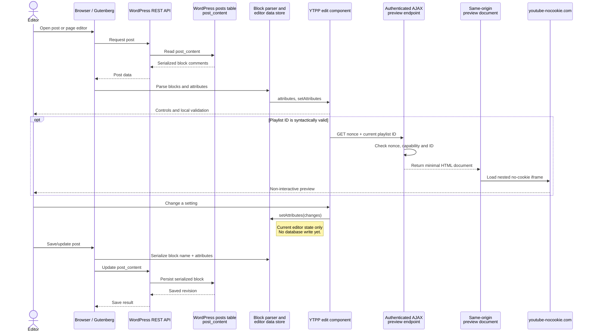
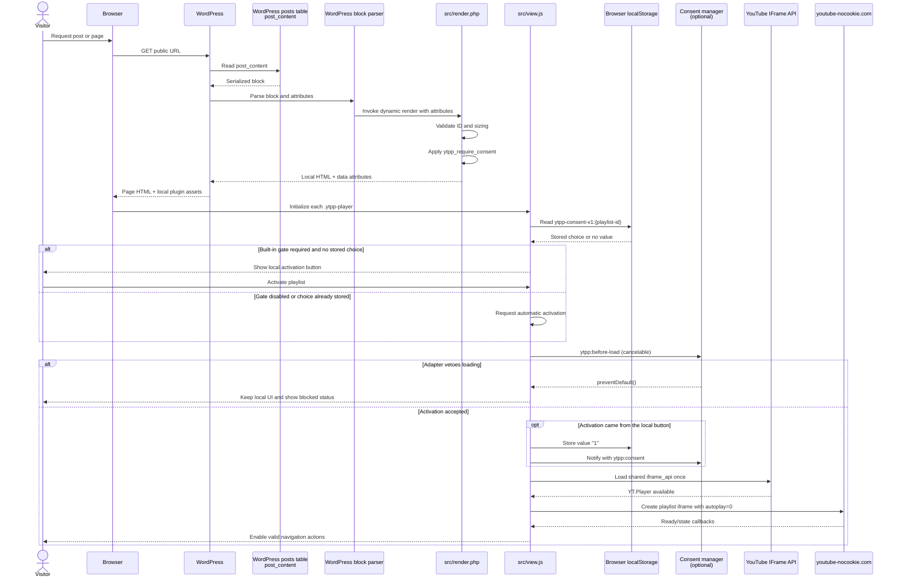

# Runtime architecture

## Persisted block configuration

The block's declared attributes have no HTML `source`. WordPress therefore
serializes their values in the block comment inside the post's `post_content`
field. The standard WordPress parser reconstructs the attribute object when it
loads the block.

The plugin does not store its block configuration in a custom table, post meta
or browser storage. Browser `localStorage` contains only the optional
playlist-specific consent choice.

### Display in the editor

The preview request receives the current in-memory playlist ID. It does not
reload the block configuration from the database. Empty or invalid input stays
local and creates no preview document.

Availability checking is a separate explicit action. A hidden direct-child
check document loads the IFrame API. It reports a classified result through a
source-and-origin-validated `postMessage`, then is removed after a result or
timeout. See [ADR 0001](decisions/0001-keyless-playlist-availability-check.md).

### Display on a post or page

`src/render.php` is the authoritative public markup renderer. It validates the
playlist again on the server, derives canonical sizing and applies the consent
filter. Dynamic rendering keeps published posts independent of generated
markup from an older plugin build.

## Public player lifecycle

Each `.ytpp-player` starts as local markup. An activation can originate from:

- the local consent button
- a remembered per-playlist choice
- configuration without the built-in gate
- an integration command
- a retry after failure

Every attempt first emits cancelable `ytpp:before-load`. After acceptance, the
shared IFrame API is loaded once. Each block creates its own
`www.youtube-nocookie.com` player with autoplay disabled.

The controller maintains state independently for each block. It also manages:

- position and navigation boundaries
- focus transitions
- live status and error output
- 15-second API and player-readiness timeouts
- retry to the original local markup

The video area is a named region. Only this region carries `aria-busy` while
loading. Status and error output use separate, always-present `status` and
`alert` regions. The visual `x / n` value is hidden from assistive technology;
an atomic `Video x of n` message supplies the accessible equivalent.

The exact event, focus and storage contracts are in
[consent integration](../integrations/consent.md).

## Failure and trust model

- WordPress validates permissions, nonces and input before producing editor
  documents.
- Browser messages are accepted only from the expected window and origin.
- YouTube failures remain external failures. An ambiguous availability result
  is not reclassified as invalid input.
- Revocation stops plugin-owned players. It cannot retract completed network
  requests.
- A shared third-party script remains available because another component may
  still use it.

## Consent persistence

A local button grant stores `1` under
`ytpp-consent-v1:<canonical-playlist-id>` in localStorage. The key is scoped by
browser origin and playlist. External grants do not persist another local
choice. Storage access failures allow activation for the current page.

## Editor document boundaries

For editors, a syntactically valid playlist ID immediately creates a preview.
The outer iframe uses an authenticated, nonce-protected URL on the same WordPress
site. Its minimal document embeds the actual player exclusively from
`https://www.youtube-nocookie.com`. This extra same-origin boundary supplies the
HTTP referrer YouTube requires even when Gutenberg renders its editor canvas from
a `blob:` URL. It does not proxy video data through WordPress.

The preview lets the editor see the playlist while editing, but it also
establishes an external connection before the post is viewed on the public site.
The block inspector displays this notice. No preview or external resource is
created for empty or syntactically invalid input. The preview and its visible
navigation representation are deliberately non-interactive so that clicks select
the block and expose its settings.

## Editor availability check

For a syntactically valid playlist, the inspector offers **Check playlist
availability**. The plugin loads `https://www.youtube.com/iframe_api` inside the
dedicated, visually hidden and authenticated same-origin check document only
after the editor selects this button. The check document is a direct child of the
inspector and is removed after a result or timeout. Its player remains on
`https://www.youtube-nocookie.com`. No API key, OAuth token or editor identity is
sent by the plugin.

The check reports a positive result only when the player returns at least one
playlist item. Missing/private content and embedding restrictions reported by the
player are shown as unavailable. Network failures, blocked requests, timeouts and
ambiguous player errors are shown as not clearly determinable rather than as an
invalid playlist. The complete decision and its limits are documented in
[ADR 0001](decisions/0001-keyless-playlist-availability-check.md).
